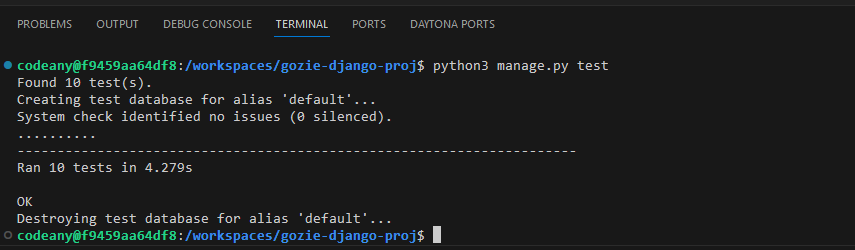

# MindBodyHealth

MindBodyHealth is a django-based blog site which runs in the Code Institute mock terminal on Heroku. It seeks to help people learn to thrive in this fast-paced and highly-demanding world by collecting testimonies of people who overcame chronic stress, burnout and mental health challenges by applying scientifically proven simple techniques proferred to them by their counsellors that rewired their brains and restored and retained their mind and body health. The site will be targeted towards all kinds of people, but especially towards students, workers and parents on whom the demands of society keep increasing on every side. The stories in this blog site are real and have been recorded by book authors, some of which were their counsellors and others are the authors' own experiences. 

## Using MindBodyHealth

Upon visiting MindBodyHealth's website, the user will be greeted with the homepage which contains the navigation links and the first page of the collected stories. The user can freely click on any feature or story to discover its content in detail. This blog site is responsive to all device sizes and works effectively on all types of browsers.

## Features

### Home Section

The Home Section is the first page the site user is greeted with upon visiting the site for the first time. It is open to all site visitors and registered users. The stories are displayed on the Home page. At the bottom of the home page contains the blow owner's name and links to the blog owner's social media accounts.

### About Section

The About Section contains information about the blog owner and the motivation for creating the website. The About Section also contains a "Let's collaborate" subsection which is for individuals who have a project in mind, wish to co-author an article, or simply want to brainstorm some ideas.

### Register Section

The Register Section contains the Sign-Up form for site visitors who would love to register on the platform. Registered users can both read posts and comment on a post, but site visitors can only read posts and comments.

### Login Section

The Login Section contains the login page for registered users. Site visitors who visit the login page have a signup external link placed there so they can directly signup from there as they can from the Sign Up page.

## Technologies Used

The website was designed using the following hosting services and programming languages:

- Django

- Cloudinary (for external image management)

- ElephantSQL for the PostgreSQL

- Python

- JavaScript

- HTML5

- CSS3

- [Google Fonts](https://fonts.google.com/) was used to obtain the two fonts, Lato and Sans-Serif used in the website.

The Codeanywhere workspace was used to write the code. 

• All the codes, README and the commits were pushed to GitHub repository

• The fonts used were obtained from the Google Fonts library in google

## Validation Testing

The author has tested the website's user interface and has found out that it looks the same on the browsers- Google Chrome, Mozilla Firefox and Microsoft.

- The HTML codes have been tested using validation by url in the w3C HTML Validator and no errors were returned.

- The Python code for the blog views have also been tested and returned no errors.

## Testing Forms and Views

The forms and views have been tested on the codeanywhere workspace terminal and the tests, totalling to 10 tests returned successful.

## Accessibility Requirements

MindBodyHealth has been tested using Lighthouse on Google and found to completely meet Accessibility Requirements, in addition to having Best Practices, and more, as indicated in the screenshot below:

## Deployment to Heroku

The full-stack project was deployed using the Code Institute's Heroku mock terminal by the following major steps:

- Clone or fork the repository
- Click the "Create New App" button in the Heroku platform
- Add the keys: CLOUDINARY_URL, DATABASE_URL, and their values from their corresponding files.
- I also added a SECRET_KEY and created a private value for it
- From the Settings, I linked the app to the repository
- Click on the "Deploy" button

The project was deployed to heroku with the following link: [MindBodyHealth Heroku App](https://mind-body-health-1a3a657f9bb9.herokuapp.com/)

## Bugs, and How I Fixed Them
I had initially used i-tags for the social media links, but because I wanted them to be active, I added href attributes and changed the tags to anchor tags.

## Contact information

The website developer's contact details are as below:

Email: inekwegoziechukwu@gmail.com

## Acknowledgements and References

- _Blog Post Content_: The contents of the blog posts are real life stories of individuals, extracted from the blog owner's personal testimony and from the book titled "The 5 Resets" written by the Harvard stress expert, Dr. Nerurkar Aditi.

- _Code Institute's Mock Terminal Form Dump Url_: The [Code Institute's Form Dump url](https://formdump.codeinstitute.net/) was used in my code for the posting of the form in the 'signup.html'.

- _User Interface, Experience and Logic Design_: A large part of the UI/UX and website interactivity design were obtained from the mock project- _Codestar blog_ by the Code Institute.

- _Deployment Terminal_: The deployment terminal used in the project was created by Code Institute.

- _Images_: All images were downloaded from [Pixabay](pixabay.com) free source, except the image in the About Section of the blog site, which was downloaded from the mock project- _Codestar blog_ by the Code Institute.